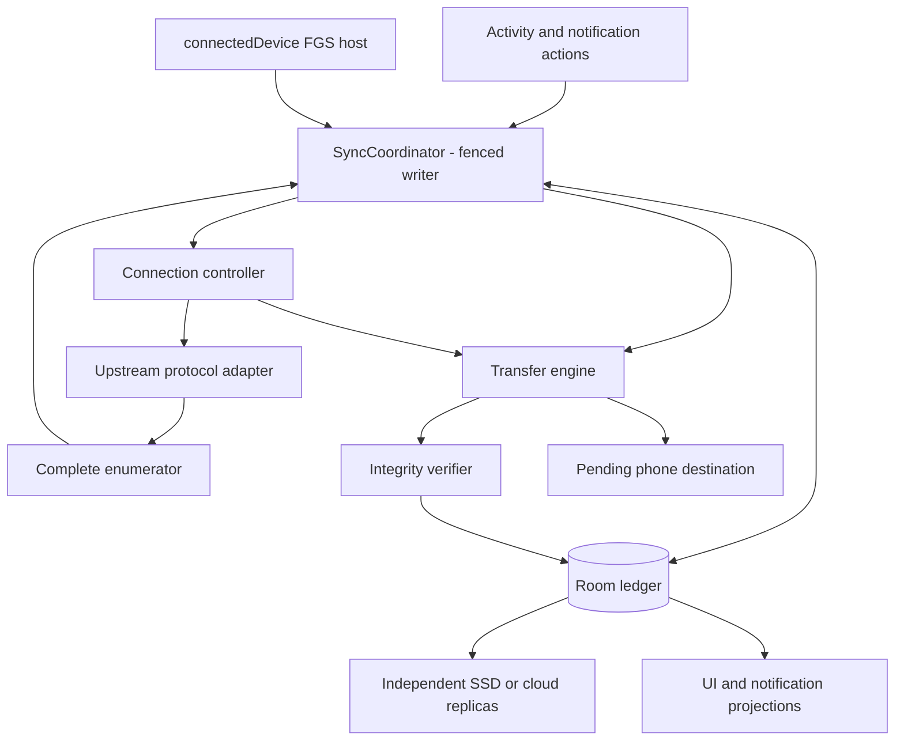

# Architecture

Current execution policy (2026-09-17): GATE-2 implementation is authorized; AGENTS.md now permits continuous progression through sufficiently defined non-destructive gates after dependency/evidence checks. Earlier statements requiring a new permission solely at a gate boundary are historical and superseded. Hardware explicitly resumed for non-destructive GATE-2 validation on 2026-09-17; earlier pause statements below are historical. No main mutation, merge, release or real deletion is authorized. Current implementation/evidence status is PROJECT_STATE.yaml, the active GATE-2 plan and docs/evidence/GATE-2/2026-09-17_hardware/REPORT.md.

## Status

[ADR0007](decisions/0007-security-closure-disposition.md) records the original blocked review; [ADR0008](decisions/0008-b1-b2-security-remediation.md) closes B1/B2 with evidence and GATE-1 PASS. GATE-2 software foundations are implemented under ADR0009 and the current continuous execution policy; physical integration remains NOT_TESTED. [Platform evidence](evidence/GATE-1/2026-09-17_security-closure/PLATFORM.md) defines the selected credential migration, exact-IP plus per-Network cleartext boundary and target36 execution contract. CameraConnectionManager is the CameraConnectionController below, not a second owner. [Ledger classification](evidence/GATE-1/2026-09-17_security-closure/DEPENDENCIES_LEDGER.md) selects minimized app-private/no-backup records without adding DB encryption; credentials are separately protected. Architecture evidence is distinct from the target's unimplemented controls and deferred hardware proof. The closure report maps every outstanding runtime assumption to a later gate; implementation is governed by the current active plan and AGENTS continuous policy.

This document separates:

- **Observed baseline facts** that must be re-verified against the repository.
- **Proposed project architecture** that is not yet implemented.

No functional implementation is authorized at bootstrap.

## Intent rebase design — 2026-09-17

Accepted in principle by user review (ADR0005), not installed architecture or technical validation. The app-open contract intentionally starts/attaches to a transactional sync session; manual grid/queue operations are a recovery fallback. [Execution ADR](decisions/0003-android-sync-execution.md), [Network ADR](decisions/0004-camera-network-ownership.md), [ledger design](design/LEDGER_AND_INTEGRITY.md), [state machines](design/STATE_MACHINES.md) and [asset policy](design/ASSET_INCLUSION_POLICY.md) specify the target. Existing observed behavior below remains unchanged.

| Boundary | Owner / responsibility |
|---|---|
| Presentation | Activity/ViewModel observes immutable ledger projections; permission/consent UI and intentional commands only |
| SyncCoordinator | One fenced single writer per active camera/session; structured coroutine scope, planner, cancellation and truth |
| Execution host | connectedDevice FGS recommendation, conditional HIL; owns coordinator lifetime independently of Activity |
| CameraConnectionController | BLE discovery, pairing/AP wake, Network request and epoch, bounded recovery; emits typed state, owns no transfer truth |
| Protocol adapter | Upstream packet/handshake knowledge; one live datalink; explicit network context and session health |
| MediaRepository / enumerator | Walk every store/page/group, classify originals/companions, produce versioned completeness evidence |
| SyncPlanner | Compare current asset versions with verified/partial replicas, schedule missing work and automatically reevaluate after READY |
| CaptureTimeResolver / DestinationPlanner | Apply R-037 source trust/priority, persist capture-local day and uncertainty, reserve stable recording-member paths before allocation; no date recalculation on retry |
| TransferEngine | Bounded streams/range validation/checkpoints; fenced IO children, no UI queue dependency |
| Ledger | Room design, durable intents/identity/recordings/replicas/evidence and migrations; canonical reconciled truth |
| IntegrityVerifier | Checks explicit assurance policy; never equates EOF or local hash with source equality |
| Destination adapters | Pending phone storage first; later SAF SSD and independent cloud replication |
| CleanupCoordinator (accepted future GATE-9) | Separate confirmed snapshot operation, exclusive camera-write lease, durable per-asset intents and exhaustive post-verification; no automatic trigger |
| GPS recording sync | Optional opted-in telemetry owner, shared connection arbitration; never a backup prerequisite |
| Diagnostics | Always-available sanitized bounded events; separate temporary opt-in verbose mode and sanitized explicit export |

## Required questions A-Q — concrete answers and proof limits

| Question | Selected design answer / unresolved proof |
|---|---|
| A. Session owner | SyncCoordinator under execution host; persisted session UUID/lease/epoch, never MainActivity |
| B. Network owner | CameraConnectionController owns callback/current Network in memory; epoch-fenced camera adapters |
| C. Reconnect without Activity | Controller drives association scan, proven AP wake, specific Network request and protocol handshake; platform consent uses USER_ACTION_REQUIRED, not hidden UI |
| D. Execution API | connectedDevice FGS for external-device session; ADR 0003 compares UIDT/dataSync/WorkManager/CDM and requires S25 proof |
| E. Screen off | Same service-owned state, bounded IO; CPU wake behavior explicitly tested and narrowly justified lock only if needed; no guaranteed immunity to OS limits |
| F. Background | Observer detaches; service/connection ownership remains; no Activity.onStop disconnect or Activity-created transfer job in target design |
| G. Android kills process | Lease fenced on allowed restart, reconcile bytes/ledger/source; no callback-dependent safety or promised automatic restart timing; force-stop requires user reopen |
| H. Camera unreachable | Preserve PARTIAL, classify reason, bounded backoff; power/approval/permanent conditions become specific user action |
| I. Unique asset | Internal immutable assetVersion + evidence-based camera/storage/object fingerprint; cross-epoch stability not proven, uncertain matches revalidate |
| J. LOCAL_VERIFIED | Exact size/version, correct range/body completion, readable flushed URI, finalized publication, recorded verification method; optional source checksum only if real |
| K. Partial reconciliation | Persisted URI plus actual length/checkpoint/source validation; no append of changed object or full 200 response; journal cross-system publication |
| L. Replica independence | Separate destination/replica records and required policy; recording-member completeness per destination; phone verified first |
| M. Cloud isolation | Per-Network camera sockets and separate Internet client; sequential camera then cloud default, concurrent Internet NOT_VERIFIED |
| N. CAMERA SYNC COMPLETE | Complete stable source inventory, required and precautionary member set resolved/preserved under asset policy, every required phone assetVersion LOCAL_VERIFIED; unrelated unknowns do not imply failure |
| O. SAFE TO CLEAR CAMERA | Current phone plus independent SSD/cloud proof and any additional required replicas, source/identity revalidation and no ambiguity; scoped informational status, separate confirmed cleanup only |
| P. Genuine user cases | Pairing, Android approval, revoked permission, proven credential change, persistent camera absence, ambiguity/identity uncertainty, storage/grant failure, explicit user stop |
| Q. Proof | TEST_MATRIX automated fault boundaries plus real SM-S938B/Pocket4P lifecycle, permissions, routing, inventory and recovery; none newly run during pause |

Single writer serializes transitions; structured IO child failures become typed events, not unhandled scope cancellation that fabricates completion. Cancel/stop closes streams and releases network resources under finally blocks; durable truth must already be safe if finally never runs. Protocol adapters remain thin so upstream updates remain reviewable.

## Observed baseline facts to re-verify

Observed read-only on 2026-09-16:

- Android/Kotlin application.
- compileSdk 36, targetSdk 36, minSdk 29.
- JVM/JDK 21.
- versionName observed as 1.4.4, versionCode 29.
- Existing camera protocol implementation should be preserved where possible.
- Existing resumable/range download capability exists in the current download path.
- Roadmap notes that long downloads are started from an Activity-owned bare Thread, so process death can interrupt them.
- Roadmap describes a stateless grid tick. The 2026-09-17 source review confirms persisted resume URIs and MediaStore completed-copy lookup across restarts; this is not a durable verified backup ledger. See the GATE-0 baseline evidence.
- Current baseline writes media through existing app behavior; no project-specific persistent backup ledger exists yet.
- No project-specific OneDrive pipeline exists yet.

## Proposed component model

The completed GATE-0 hardware run observed persistent completed files/MediaStore rows but failed UI downloaded-state recognition after restart and manual reconnect. Keep these states distinct in GATE-1 design; source presence of a completed-copy lookup does not supersede observed UI behavior. Automatic reconnect and job resume also failed, while manual range continuation from the retained partial passed. All remain measured baseline limitations; no behavior was changed.

Preserve upstream protocol layer.

Add project-specific capabilities as isolated modules where practical:

- `backup/`
  - orchestration
  - run state
  - policy
- `ledger/`
  - persistent media identity/state
  - idempotency
  - recovery
- `integrity/`
  - completion checks
  - size/checksum policy where source capabilities allow
- `storage/`
  - local verified store/staging
  - P310/external storage adapter
  - later OneDrive adapter
- `diagnostics/`
  - privacy-preserving incident pipeline

## Proposed high-level flow

Camera protocol
→ media enumeration
→ backup orchestrator
→ persistent ledger
→ transfer/resume
→ integrity verification
→ verified local state
→ downstream storage adapters
→ status/diagnostics

## Network considerations

Camera access may require binding traffic to the camera Wi-Fi/AP while later cloud sync requires ordinary Internet connectivity.

The design must explicitly handle network ownership/routing transitions. Do not assume camera-network binding and OneDrive Internet access can occur simultaneously without evidence.

Camera-side sleep/standby must be modeled separately from Android background/process lifecycle and generic reconnect failures. The 2026-09-17 user-reported apparent idle transition is provisional: actual sleep, Wi-Fi/BLE/session effects, wake recovery and active-transfer exposure are not yet established. See [separate evidence](evidence/GATE-0/2026-09-17_hardware/CAMERA_SLEEP.md) and RISK-016. GATE 1 must specify safe state detection and recovery for one-tap backup using measured camera capabilities, without assuming a dark display means lost connectivity or modifying camera power settings during baseline verification.

A separate awake-camera/foreground-app connection failure is recorded as [FOREGROUND_SESSION_DROP](evidence/GATE-0/2026-09-17_hardware/FOREGROUND_SESSION_DROP.md), RISK-019. A camera playback message concurrent with the app's failure message suggests a possible session-state mismatch but does not prove the cause or live connectivity. GATE 1 must distinguish transport, protocol session and UI state; this occurrence is neither a sleep nor an app-background disconnect.

## Storage considerations

R-037 requires automatic capture-day folders and shared parent-recording grouping across phone/SSD/cloud. See [capture-day design](design/CAPTURE_DAY_ORGANIZATION.md) for immutable allocations, explicit timezone fallbacks, conflict handling and mixed-MIME storage feasibility. The baseline writes flat MIME-specific roots and attempts camera clock synchronization on connect; neither proves target timestamp correctness. Ledger path changes and completed-copy lookup must be designed together. Existing files are not moved or redownloaded by this planning change.

External storage is expected to require Android storage APIs such as SAF or an equivalent supported mechanism. Verify target-device behavior before architecture is finalized.

## Accepted safety and optional-feature boundaries

[Asset policy v2](design/ASSET_INCLUSION_POLICY.md) separates enumeration/recording/local/redundancy/safety predicates and six classes. [Cleanup design](design/VERIFIED_SNAPSHOT_CLEANUP.md) specifies confirmation, races, state machine, audit and unverified protocol limits. [GPS/diagnostics design](design/GPS_AND_DIAGNOSTICS.md) separates backup from optional telemetry and logging. Neither a completed sync, GPS preference nor diagnostic flag can initiate deletion. [ADR0006](decisions/0006-cleanup-gate-and-authorization.md) adopts cleanup dependencies and one-confirmation UX, immediate safety revocation, plan/proof binding and bounded same-live-operation continuation. No functional changes are made; target capabilities remain unverified.

## Security boundaries

Trust boundaries include:

- camera local network
- Android app process
- local storage
- external SSD
- future OneDrive auth/API
- diagnostics
- GitHub / build / release pipeline

## Thin-fork rule

Do not rewrite upstream protocol implementation unless evidence shows it is necessary. Prefer additive, isolated modules and upstream-compatible changes.
