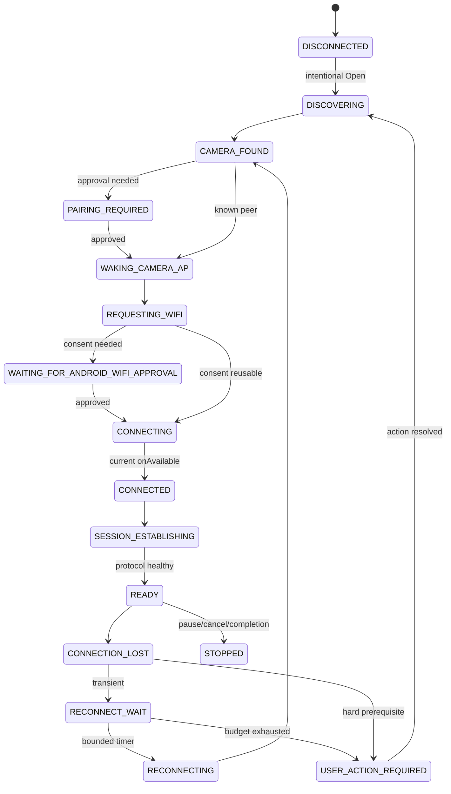

# Connection and synchronization state machines

Design only; callbacks/events carry sessionId, ownerEpoch and networkEpoch. Coordinator accepts a transition only for the current owner and legal predecessor, writes reason/intent transactionally, then triggers cancellable effects. Actual Network/socket/BLE handles are reconstructable resources, not serialized state.

## Connection states

| State | Entry / exit conditions |
|---|---|
| DISCONNECTED | No usable transport; intentional session start -> DISCOVERING |
| DISCOVERING | Bounded scan of known association; matching peer -> CAMERA_FOUND; ambiguity/permission -> USER_ACTION_REQUIRED |
| CAMERA_FOUND | Validate camera identity and capability; unpaired -> PAIRING_REQUIRED; otherwise WAKING_CAMERA_AP |
| PAIRING_REQUIRED | Platform/camera approval required; only explicit approval advances; refusal stops retry |
| WAKING_CAMERA_AP | Use proven existing protocol AP wake; no assumption sleeping/powered-off device is wakeable; bounded timeout -> RECONNECT_WAIT or user action |
| REQUESTING_WIFI | Controller registers one specific local-only request; required consent -> WAITING_FOR_ANDROID_WIFI_APPROVAL |
| WAITING_FOR_ANDROID_WIFI_APPROVAL | Notification directs user to allowed Activity flow; no credential diagnosis from missing consent; accepted -> CONNECTING |
| CONNECTING | Await callbacks for current epoch; onAvailable -> CONNECTED; timeout/onUnavailable classifies reason |
| CONNECTED | Transport exists, protocol not ready; -> SESSION_ESTABLISHING |
| SESSION_ESTABLISHING | Reuse upstream handshake/registration; protocol liveness and camera identity validated -> READY |
| READY | Enumerate/transfer permitted; matching transport loss or validated protocol-health failure -> CONNECTION_LOST |
| CONNECTION_LOST | Fence/close old IO, retain checkpoint and invalidate matching Network; classify evidence -> RECONNECT_WAIT or USER_ACTION_REQUIRED |
| RECONNECT_WAIT | Persist reason/attempt/nextEligibleAt; timer/camera availability -> RECONNECTING; cancellation -> STOPPED |
| RECONNECTING | Reconstruct necessary BLE/AP/Wi-Fi/protocol layers; no duplicate sessions; follows CAMERA_FOUND through READY |
| USER_ACTION_REQUIRED | Concrete action/blocked prerequisite, no endless scans; action confirmed -> re-evaluate prerequisites |
| STOPPED | Persisted pause/cancel/system stop policy; new intentional start reconstructs, never trusts previous READY |

On startup any persisted transient state is historical evidence: transition through reconciliation/discovery, not READY. A transport can be live while protocol health is lost; distinguish SESSION_STATE_DESYNC hypothesis from NETWORK_LOST. Expected BLE release after handoff must not automatically invalidate a still-healthy Wi-Fi session without target evidence.

## Orthogonal session / transfer lifecycle

Session: REQUESTED -> RECONCILING -> ENUMERATING -> PLANNING -> SYNCING -> FINAL_ENUMERATION -> COMPLETE, with WAITING_CONNECTION, PAUSED, USER_ACTION_REQUIRED or STOPPED from any active phase. COMPLETE is computed from generation/replicas, never a service exit. A new Start when active attaches to the same session; new source arrivals after completion create a successor generation, not a second engine.

Transfer: DISCOVERED -> QUEUED -> TRANSFERRING -> VERIFYING -> LOCAL_VERIFIED. IO interruption -> PARTIAL -> RETRY_PENDING; READY event makes the planner automatically revalidate every PARTIAL and then TRANSFERRING from a safe nonzero offset. Reconnection does not itself promote transfer state. Identity/storage failure -> USER_ACTION_REQUIRED or FAILED with recoverable evidence. An explicit user cancellation retains bytes and records intent; it is not a completed asset. Verification failure cannot skip directly to verified on retry.

## Distinct reason taxonomy and policy

| Reason | Evidence needed / handling |
|---|---|
| APP_BACKGROUND_SESSION_LOSS | Correlated Activity visibility + actual loss, observed baseline; engine must outlive UI |
| CAMERA_SLEEP_OR_IDLE | Confirm camera power/session state, not just black screen; currently uncertain |
| CAMERA_POWER_OFF | User/authoritative state evidence; bounded waiting then request power-on, no remote wake promise |
| WIFI_NETWORK_LOSS | Current Network callback/capability evidence; reacquire then handshake |
| BLE_SESSION_LOSS | GATT state; determine expected handoff versus required-control failure |
| FOREGROUND_SESSION_DROP | Awake camera/foreground app failure observed; diagnose transport/protocol independently |
| SESSION_STATE_DESYNC | Candidate mismatch; must reconcile protocol state, no asserted cause from display text |
| ANDROID_PROCESS_DEATH | Exit info/recovered stale lease; reconcile disk/ledger/source; no lost callback assumption |
| ANDROID_JOB_OR_SERVICE_STOP | Stop reason/eligibility when available; checkpoints already durable, honor user stop |
| PERMISSION_REVOKED | Actual permission denial/state; prompt via user action, not credentials |
| CREDENTIAL_CHANGED | Positive authentication evidence or confirmed user change; generic onUnavailable is insufficient |
| CAMERA_REQUIRES_USER_CONFIRMATION | Explicit pairing/activation/approval condition; wait for user, no bypass |
| STORAGE_FAILURE | ENOSPC, provider/write/close error, unavailable volume or lost grant; preserve good copy, specific action |
| SOURCE_IDENTITY_CHANGED | Version/storage evidence changed; no unsafe append/dedup |
| UNKNOWN_CONNECTION_FAILURE | Default when evidence insufficient; preserve uncertainty, bounded recovery |

Every event records both observed reason and confidence/candidate cause, so similar symptoms remain separate. UI must not display stale-password instructions without credential evidence.

## Retry policy proposal (tunable, not measured constants)

Transient network/timeout/session/busy errors: full jitter delay U(0, min(60 s, 2 s * 2^attempt)), maximum eight attempts or ten minutes of a recovery episode, whichever first; one active timer, bounded BLE scan windows <=10 s per attempt. Persist count, reason, wall deadline and elapsed policy; after reboot clamp anomalous clock changes rather than executing a retry storm. A READY handshake alone does not reset the counter: reset after 60 s stable health or one successfully verified asset. A flapping session consumes budget.

404/500 must preserve upstream's documented temporary-busy possibility; revalidate same identity/session and retry under budget, not declare deletion immediately. Permission/positive auth rejection/ENOSPC stop active retries and demand concrete action. Potentially recoverable AP/BLE absence uses the same bounded episode, then releases resources and reports action/waiting. No indefinite scans or always-held wake lock. Approved presence/foreground re-entry may initiate a new bounded episode; hidden repeated timer reset is forbidden.

## Structured diagnostics and UX

Allowlist events: SESSION_STARTED, BLE_FOUND, AP_WAKE_REQUESTED, WIFI_REQUESTED, WIFI_AVAILABLE, CAMERA_SESSION_READY, NETWORK_LOST, PROTOCOL_TIMEOUT, RECONNECT_SCHEDULED, RECONNECT_SUCCESS, RECONNECT_EXHAUSTED, TRANSFER_STARTED, TRANSFER_PARTIAL, RANGE_RESUME_STARTED, TRANSFER_VERIFIED, PROCESS_RECOVERY, USER_ACTION_REQUIRED, ENUMERATION_INCOMPLETE, SESSION_STOPPED.

Payload: monotonic sequence, UTC/elapsed, pseudonymous session/asset IDs, type, reason/confidence, old/new state, attempt, byte offset/total, HTTP status and validated range boundaries, platform stop reason. No passwords/tokens, GPS, SSID/MAC, raw media paths/content, raw protocol or exception messages. A typed serializer owns redaction and export schema; test injected secrets cannot enter output. Bounded ring retention proposal 7 days/10 MiB, deletion/export under user control. Ledger needs private source locators; diagnostics do not.

Notification/UI observe ledger-derived state: connected/reconnecting/waiting, opaque item or user-local filename, bytes, n/total only when known, retry reason, Pause/Cancel, action required and snapshot completion. Hide filenames on lockscreen by default. Notifications never translate job/service termination into success.
