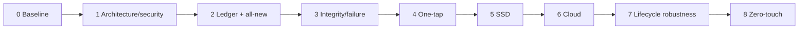
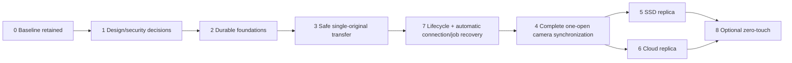

# Gate dependency rebase proposal — 2026-09-17

Status: PROPOSED ordering/scope migration, not silently adopted renumbering. GATE-0 evidence/status retained; GATE-1 design review active but not PASS. All implementation authorization remains false. Current explicit product contract already forbids accepting one-tap reliability before lifecycle/recovery proof, regardless of proposal adoption.

## Historical graph and mismatch

This was a listed sequence, not measured dependency proof. Placing lifecycle/network ownership after one-tap/replication permits a false product claim. All-new backup before integrity/canonical identity can also create false success. Required security, diagnostic and crash-consistency foundations must precede real user workflows.

## Proposed dependency-safe graph (IDs retained)

Planning/isolated experiments may be parallel only after authorization; a PASS requires all predecessors. GATE-5/6 independent branches avoid requiring Internet/cloud for SSD or phone success. Proposed execution order 0 -> 1 -> 2 -> 3 -> 7 -> 4 -> (5,6) -> optional 8. Do not rename historical evidence directories to pretend chronological gate numbers.

| Gate ID | Proposed scope change / explicit acceptance |
|---|---|
| 0 | Unchanged reproducibility with disclosed measured failures; not retroactively re-scored against new feature requirements |
| 1 | Approve execution/network/identity/integrity/asset/power/security design, resolve user policy decisions, define platform limitations and test plan; capability experiments separately authorized; no architecture claim without A-Q answer and evidence/validation boundary |
| 2 | Durable foundations: Room migrations, fenced coordinator, single owner/observer UI, connection/transfer projections, recording relationships and redacted events. Move broad all-new feature claim out. Duplicate Open and crashes at intent/URI boundaries cannot produce false VERIFIED; no ledger wipe on upgrade |
| 3 | Safe one-original and recording-member transfer: correct 200/206/Content-Range/size/version handling; stable partial, ENOSPC, publication crash recovery; preserve baseline range behavior and verified copies; no falsely complete partial in tests |
| 7 | Move before one-tap: service-owned real camera session, app switch/lock/recreate/OS stop handling, foreground drop recovery, network/AP/BLE recovery, automatic safe PARTIAL continuation, explicit user actions, no duplicate owner or battery retry loop. Actual S25/Pocket HIL required; unknown camera sleep cannot be declared handled |
| 4 | Complete all-original snapshot/recording discovery, automatic planner, final enumeration, UI recognition, idempotent repeated open. Zero normal-operation manual select/queue/rescan/retry; known platform consent exceptions are explicit. Must pass G2/G3/G7 and absent cloud must not impede phone completion |
| 5 | Independent SAF SSD replica with persisted grant/remount, hash/equality verification where meaningful, removal failures isolated from phone; never weaken local truth |
| 6 | Independent OAuth/network/cloud replica, offline/expiry/resume policy, no camera route leakage, optional UIDT/WorkManager design re-reviewed for actual use |
| 8 | Optional camera appearance trigger only after association/presence and Android eligibility evidence; explicit user opt-in, no claim it bypasses force-stop or permissions |

## Migration and adoption record

1. Preserve completed GATE-0 plan/evidence and prior 0-8 names. This commit persists previously uncommitted hardware evidence without changing outcomes or closing unknown causes.
2. Link this proposal from QUALITY_GATES and REQUIREMENTS; label historical ordering. Do not move old GATE-7 evidence into GATE-2; no such implementation evidence exists yet.
3. At user review, record explicit adoption/revisions in an ADR. Then amend active acceptance criteria and task plans using retained IDs and dependencies. Until then future gates are NOT_TESTED, not implied authorized work.
4. Map test IDs to responsible gates before code authorization. GATE-1 acceptance and implementation authorization are separate events. Reopen an ADR if HIL contradicts a design assumption rather than weakening the test to pass.
5. Reporting distinguishes baseline reproduction, design approval, implemented capability and hardware proof. No one-tap claim until GATE-7 and full enumeration/recording policy pass.
